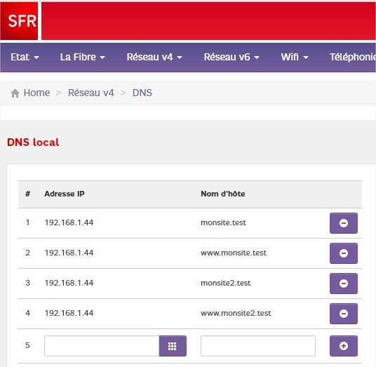

# Les VirtualHosts

## Architecture 

```
/var/www/
|-- logs/
|   |-- monsite_error.log
|   |-- monsite_access.log
|
|
|-- monsite/
|   |-- index.php
|
|
```

## hosts 

Il faut modifier le fichier hosts sur la machine cliente (celle qui va visiter le site web), ou sinon le faire directement sur le serveur DNS (ici ma Box par exemple)

- fichier hosts : 

  ```textile
  # Ajouter : <IP> monsite.dev www.monsite.dev
  ping monsite.dev
  ```

- Serveur DNS de ma box

  

## Config

```shell
cp /etc/apache2/sites-available/000-default.conf /etc/apache2/sites-available/monsite.conf
nano /etc/apache2/sites-available/monsite.conf
```

```apache
# Apache doit écouter sur le port 80 pour le http
# il est aussi possible de répondre à des requêtes sur des ports non standards
# ou même de ne pas définir de port spécifique en utilisant "*"
<VirtualHost *:80>
    # nom d'hôte que le serveur utilise
    ServerName monsite.fr
        
    # noms alternatifs que le serveur utilise pour servir le même contenu
    ServerAlias www.monsite.fr blog.monsite.fr
       
    # email de contact de l'administrateur (apache l'affiche sur certaines pages d'erreurs)
    ServerAdmin adresse@mail.com

    # path de la racine du contenu à servir
    DocumentRoot /var/www/monsite/

    # logs d'erreur
	ErrorLog /var/www/logs/monsite_error.log
    # logs de connexion (le common veut dire qu'on utilise le regex d'heure standard pour les logs)
	CustomLog /var/www/logs/monsite_access.log common

    # ces règles s'appliquent à tous le dossier
    <Directory /var/www/monsite/>
        # interdiction de lister les fichiers dossier au cas où pas de page index présente
        # suivre les liens symboliques (gain de performance)
        Options -Indexes +FollowSymLinks

        # .htaccess peut redéfinir ces paramètres [All|None]
        # on gagne en performance à mettre à none
        # on perd néanmoins en souplesse de configuration 
        AllowOverride None

        # on précise que tous les utilisateurs ont accès au dossier web
        # ainsi, en cas de maintenance, on peut s'autoriser uniquement soi même
        Require all granted 
    </Directory>
</VirtualHost>
```

### Vérification de la syntaxe :

```
apache2ctl configtest
```


### Activer ou désactiver un vhost

- **a2ensite** : activer un vhost
- **a2dissite** : désactiver un vhost

```
a2ensite monsite.conf
service apache2 reload
```

## <Directory> </Directory>

### Require

```apache
Require host my_alloweddomain.name
Require ip 192.168.0.110   # autorise une seule ip
Require ip 192.168.1.0 /24 # autorise 192.168.1.1 à 192.168.1.254
Require ip  172.16.0.0/16  # autorise 172.16.0.1 à 172.16.255.254
Require ip 10.0.0.0/8      # autorise 10.0.0.1 - 10.255.255.254
```


# Les modules complémentaires

la commande **a2enmod** permet d'activer un module et pour le désactiveri il suffit d'utiliser la commande **a2dismod**

Activer le module rewrite :

```shell
a2enmod rewrite
```

```shell
service apache2 restart
```

```apache
<ifModule mod_rewrite.c>
    RewriteEngine On
    #reste du code
</ifModule>
```

# Annexe :

### Variables : 

Le fichier des variables fichier /etc/apache2/envvars  sous la forme ${Nom_variable}


### Rotation des logs

Il est important de mettre un système de rotation des logs avec une conservation de temps définie.
```
nano /etc/logrotate.d/apache2
rotate 52     #ICI CHAQUE 52 SEMAINES
```

**Suite :** https://buzut.fr/configuration-dun-serveur-linux-apache2/#logs
