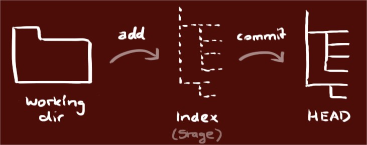

# 1) Configuration

```shell
git config --global user.name <user>
git config --global user.email <mail>
```

On peut retrouver sur le dossier courant le fichier ".gitconfig" qui contient toute notre configuration

# 2) Initialiser/Vérifier un depot

```shell
git init
```

```shell
git status
```

# 3) Les arbres

Le dépôt est composé de trois "arbres". le premier est mon espace de travail qui contient réellement mes fichiers. le second est un **INDEX** qui joue un rôle d'espace de transit pour mes fichiers et enfin **HEAD** qui pointe vers la dernière validation que j'ai faite.



# 4) Les commits

### Créer un commit :

- Ajouter à l'INDEX :

  ```shell
  git add <file>
  git add .
  ```

- Ajouter au HEAD :

  ```shell
  git commit [-m "description du commit"]
  ```

- Ajouter à l'INDEX puis au HEAD :

  ```shell
  git commit -a [-m "description du commit"]
  ```
__________
### Voir les différents commits :

```shell
git log
```
__________
### Se positionner sur un commit :

- Se positionner sur un commit

  ```shell
  git checkout <id_commit1>
  ```

- Retourner au commit le plus récent :

  ```shell
  git checkout master
  ```

### Différences des commits :

```shell
git diff <id_commit1> <id_commit2>
```
__________
### Annulation et supression des commits (HEAD) :

- Supprimer tous les commits aprés le commit en question (non inclut) :

  ```shell
  git reset --hard <id_commit>
  ```

- Inverser les changements d'un commit :

  ```shell
  git revert <id_commit>
  ```
__________
### Annulation et supression des changement (INDEX) :

- Annuler le changement d'un fichier en phase INDEX :

  ```shell
  git checkout -- <filename>
  ```

- Annuler le changement de **TOUS** les fichiers en phase INDEX :

  ```shell
  git checkout -- .
  ```

# 5) Hors Local

__________
### Cloner un dépôt :

```shell
git clone https://<lien_vers_depot> [nouveau_nom_du_depot]
git clone /path/to/repository [nouveau_nom_du_depot]
git clone username@host:/path/to/repository
```


### Mettre à jour un dépôt local vers les dernières validations :

```shell
git pull
```

__________
### Envoyer à un dépôt distant :

```shell
git push origin master
```

Si jamais on a pas fait de git clone alors il faut mettre un depot par défaut pour faire un git push : 

```shell
git remote add origin <server>
```

# 6) Annexe :

- **Pycharm** : https://www.youtube.com/watch?v=9tGb9FK6zVM (pour le reste je peux clique droit sur le fichier en question et je peux faire toute mes actions de git)

- Commande pour calculer le nombre de lignes de code un dépôt Git:  

  ```shell
  git ls-files | xargs wc -l
  ```
